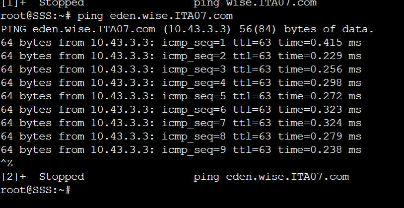

# Komunikasi Data dan Jaringan Komputer
# Laporan Praktikum Modul 2 ITA07

# Anggota

| Nama                           | NRP          | 
| -------------------------------| -------------| 
| Naftali Salsabila Kanaya Putri    | `5027201012` | 
| Ariel Daffansyah Aliski           | `5027201058` | 
| Anak Agung Bintang Krisnadewi     | `5027201060` |

## Soal Nomor 1
WISE akan dijadikan sebagai DNS Master, Berlint akan dijadikan DNS Slave, dan Eden akan digunakan sebagai Web Server. Terdapat 2 Client yaitu SSS, dan Garden. Semua node terhubung pada router Ostania, sehingga dapat mengakses internet. Maka konfigurasi terlebih dahulu sebagai berikut
* Ostania
```    
auto eth0
iface eth0 inet dhcp

auto eth1
iface eth1 inet static
address 10.43.1.1
netmask 255.255.255.0

auto eth2
iface eth2 inet static
address 10.43.2.1
netmask 255.255.255.0

auto eth3
iface eth2 inet static
address 10.43.3.1
netmask 255.255.255.0
```

* SSS
```    
auto eth0
iface eth0 inet static
address 10.43.1.2
netmask 255.255.255.0
gateway 10.43.1.1
```

* Garden
```    
auto eth0
iface eth0 inet static
address 10.43.1.3
netmask 255.255.255.0
gateway 10.43.1.1
```

* WISE 
```    
auto eth0
iface eth0 inet static
address 10.43.2.2
netmask 255.255.255.0
gateway 10.43.2.1
```

* Berlint    
```    
auto eth0
iface eth0 inet static
address 10.43.3.2
netmask 255.255.255.0
gateway 10.43.3.1
```

* Eden    
```
auto eth0
iface eth0 inet static
address 10.43.3.3
netmask 255.255.255.0
gateway 10.43.3.1
```

Lalu kami menjalankan perintah pada router utama Ostania sebagai berikut
    `iptables -t nat -A POSTROUTING -o eth0 -j MASQUERADE -s 10.43.0.0/16`
    <br/>
Pada setiap node selain router utama Ostania kami jalankan perintah berikut
    `echo "nameserver 192.168.122.1" > /etc/resolv.conf`
    <br/>
Lalu kita testing untuk Nodenya dan berhasil terkoneksi ke internet
    

## Soal Nomor 2
Untuk mempermudah mendapatkan informasi mengenai misi dari Handler, maka dibuat website utama dengan akses `wise.yyy.com` dengan alias `www.wise.yyy.com` pada folder WISE

Untuk mengerjakan nomor 2, langkah-langkahnya adalah sebagai berikut
<br/>
* Install bind
```    
apt-get update
apt-get install bind9
```

* Buka konfigurasi file `/etc/bind/named.conf.local` tambahkan sebagai berikut
```    
zone "wise.ita07.com" {
type master;
file "/etc/bind/wise/wise.ita07.com";
};
```

Lalu buat folder wise dengan `mkdir wise` pada folder bind
<br/> 
Lalu buat file konfigurasinya pada folder `/etc/bind/wise/wise.ita07.com`
```
;
; BIND data file for local loopback interface
;
$TTL    604800
@       IN      SOA     wise.ITA07.com. root.wise.ITA07.com. (
                              2         ; Serial
                         604800         ; Refresh
                          86400         ; Retry
                        2419200         ; Expire
                         604800 )       ; Negative Cache TTL
;
@               IN      NS      wise.ITA07.com.
@               IN      A       10.43.2.2
eden            IN      A       10.43.3.3
www             IN      CNAME   wise.ITA07.com.
www.eden        IN      CNAME   eden.wise.ITA07.com.
```

Setelah itu kita coba apakah berhasil membuka webservernya dari Node lain, di sini menggunakan node SSS. Tambahkan nameserver terlebih dahulu
`echo "nameserver 10.43.2.2" > /etc/resolv.conf`
<br/>
Lalu Testing menggunakan komputer SSS
    
    
## Soal Nomor 3
Setelah itu ia juga ingin membuat subdomain `eden.wise.yyy.com` dengan alias `www.eden.wise.yyy.com` yang diatur DNS-nya di WISE dan mengarah ke Eden
<br/>
Jadi, kami menambahkan konfigurasi sebagai berikut ke `/etc/bind/wise/wise.ITA07.com`
```
;
; BIND data file for local loopback interface
;
$TTL    604800
@       IN      SOA     wise.ITA07.com. root.wise.ITA07.com. (
                              2         ; Serial
                         604800         ; Refresh
                          86400         ; Retry
                        2419200         ; Expire
                         604800 )       ; Negative Cache TTL
;
@               IN      NS      wise.ITA07.com.
@               IN      A       10.43.2.2
eden            IN      A       10.43.3.3
www             IN      CNAME   wise.ITA07.com.
www.eden        IN      CNAME   eden.wise.ITA07.com.
```

Konfigurasi kami menambahkan subdomain Eden, yang akan ditesting sebagai berikut


## Soal Nomor 4
Buat juga reverse domain untuk domain utama pada `/etc/bind/named.conf.local` kami tambahkan konfigurasi sebagai berikut
```
zone "wise.ITA07.com" {
        type master;
        file "/etc/bind/wise/wise.ITA07.com";
};

zone "2.43.10.in-addr.arpa" {
        type master;
        file "/etc/bind/wise/2.43.10.in-addr.arpa";
};
```

Dibuatlah zona baru untuk reverse zonenya disimpan di `/etc/bind/wise/2.43.10.in-addr.arpa`
```
;
; BIND data file for local loopback interface
;
$TTL    604800
@       IN      SOA     wise.ITA07.com. root.wise.ITA07.com. (
                              2         ; Serial
                         604800         ; Refresh
                          86400         ; Retry
                        2419200         ; Expire
                         604800 )       ; Negative Cache TTL
;
2.43.10.in-addr.arpa. IN      NS      wise.ITA07.com.
2                       IN      PTR     wise.ITA07.com.
```

NS diubah menjadi seperti berikut dan PTR di set untuk 2


## Soal Nomor 5
Agar dapat menghubungi jika server WISE bermasalah, maka Berlint juga dibuat sebagai DNS Slave untuk domain utama. Untuk menjadikan Berlint sebagai DNS Slave kita harus menambahkan `notify yes`, `also notify`, dan `allow-transfer` sebagai berikut
```
zone "wise.ITA07.com" {
        type master;
        notify yes;
        also-notify { 10.43.3.2; };
        allow-transfer { 10.43.3.2; };
        file "/etc/bind/wise/wise.ITA07.com";
};

zone "2.43.10.in-addr.arpa" {
        type master;
        file "/etc/bind/wise/2.43.10.in-addr.arpa";
};
```

Lalu pada Berlint ditambahkan config berikut
```
zone \"wise.ITA07.com\" {
    type slave;
    masters { 10.43.2.2; };
    file \"/var/lib/bind/wise.ITA07.com\";
};
```

Untuk testingnya nameserver diurut dari slave ke master, matikan untuk bind9 pada WISE dan nyalakan bind9 pada Berlint Lalu dicoba seperti berikut ini:


## Soal Nomor 6
Karena banyak informasi dari Handler, maka dibuat subdomain yang khusus untuk operation yaitu `operation.wise.yyy.com` dengan alias `www.operation.wise.yyy.com` yang didelegasikan dari WISE ke Berlint dengan IP menuju ke Eden dalam folder operation. Tambahkan konfigurasi pada WISE sebagai berikut
```
;
; BIND data file for local loopback interface
;
$TTL    604800
@       IN      SOA     wise.ITA07.com. root.wise.ITA07.com. (
                              2         ; Serial
                         604800         ; Refresh
                          86400         ; Retry
                        2419200         ; Expire
                         604800 )       ; Negative Cache TTL
;
@               IN      NS      wise.ITA07.com.
@               IN      A       10.43.2.2
eden            IN      A       10.43.3.3
www             IN      CNAME   wise.ITA07.com.
www.eden        IN      CNAME   eden.wise.ITA07.com.
ns1             IN      A       10.43.3.3
operation       IN      NS      ns1
```

Delegasikan ns1 dan subdomain operation untuk Berlint, lalu kami lakukan konfigurasi pada options WISE pada `/etc/bind/named.conf.options`
```
options {
    directory "/var/cache/bind";

    //forwarders {
    //    0.0.0.0;
    //};

    //dnssec-validation auto;
    allow-query { any; };
    auth-nxdomain no;    # conform to RFC1035
    listen-on-v6 { any; };
};
```

dan menambahkan zone pada WISE di `/etc/bind/named.conf.local`
```
zone "wise.ITA07.com" {
        type master;
        notify yes;
        also-notify { 10.43.3.2; };
        allow-transfer { 10.43.3.2; };
        file "/etc/bind/wise/wise.ITA07.com";
};

zone "2.43.10.in-addr.arpa" {
        type master;
        file "/etc/bind/wise/2.43.10.in-addr.arpa";
};
```

Lalu pada file operations.wise.ITA07.com dibuat sebagai berikut
```

\$TTL    604800
@       IN      SOA     operation.wise.ITA07.com. root.operation.wise.ITA07.com. (
                              2         ; Serial
                         604800         ; Refresh
                          86400         ; Retry
                        2419200         ; Expire
                         604800 )       ; Negative Cache TTL
;
@               IN      NS      operation.wise.ITA07.com.
@               IN      A       10.43.3.3
www             IN      CNAME   operation.wise.ITA07.com.
```

Lalu ditest sebagai berikut


## Soal Nomor 7
Untuk informasi yang lebih spesifik mengenai Operation Strix, maka dibuat subdomain melalui Berlint dengan akses strix.operation.wise.yyy.com dengan alias www.strix.operation.wise.yyy.com yang mengarah ke Eden. Kami menambahkan konfigurasi pada `/etc/bind/operation/operation.wise.ITA07.com` sehingga menjadi seperti berikut
```
$TTL    604800
@       IN      SOA     operation.wise.ITA07.com. root.operation.wise.ITA07.com$
                              2         ; Serial
                         604800         ; Refresh
                          86400         ; Retry
                        2419200         ; Expire
                         604800 )       ; Negative Cache TTL
;
@               IN      NS      operation.wise.ITA07.com.
@               IN      A       10.43.3.3
www             IN      CNAME   operation.wise.ITA07.com.
strix           IN      A       10.43.3.3
www.strix       IN      CNAME   strix.operation.wise.ITA07.com.
```

Dapat dilihat bahwa kami membuat sebuah domain general dan alias www untuk `strix.operation.wise.ITA07.com.` yang mengarah pada Eden.
Lalu ditest sebagai berikut

